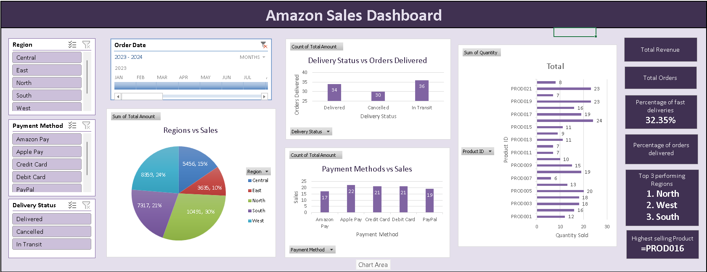

# amazon-workforce-sales-analysis
Excel Sales &amp; Workforce Intelligence Dashboard using Pivot Tables, XLOOKUP and Slicers.

# 📊 Amazon Sales Dashboard (Excel)

## 📌 Overview
An interactive Excel dashboard analyzing 100 Amazon sales records to evaluate regional revenue, delivery performance, and order fulfillment trends.

---

## 📂 Repository Files
* **`Amazon_Sales_Data_Raw.csv`** – Uncleaned raw dataset (100 records).
* **`Amazon_Sales_Analysis_Completed.xlsx`** – Excel workbook with cleaned data, XLOOKUP formulas, and Pivot Tables.
* **`Amazon_Sales_Dashboard.png`** – Screenshot of the final interactive dashboard.

---

## 🛠️ Key Techniques
* **Data Prep & Cleaning:** Standardized text, formatted dates, and handled delivery statuses.
* **Smart Lookups:** Applied `XLOOKUP` & `IFERROR` for customer profile matching and delivery classification.
* **Pivot Summaries:** Analyzed sales by region, quantity sold by Product ID, and delivery status distribution.
* **Interactive Design:** Integrated Slicers (Region, Payment, Status, Date) and KPI summary cards.

---

## 📊 Key Insights
* **Total Revenue:** 35,258 across 100 orders.
* **Top Regions:** 1. North (30% sales), 2. West (24%), 3. South (21%).
* **Delivery Performance:** 34% total delivered; 32.35% categorized as fast deliveries (<= 2 days).
* **Order Status Breakdown:** 36 In Transit, 34 Delivered, 30 Cancelled.
* **Highest Selling Product:** PROD016.

---

## 💡 Recommendations
* **Logistics:** Optimize fulfillment speed in top-performing regions (North & West) to increase the fast delivery rate beyond 32.35%.
* **Retention:** Investigate bottlenecks causing 30 order cancellations out of 100 total transactions.
